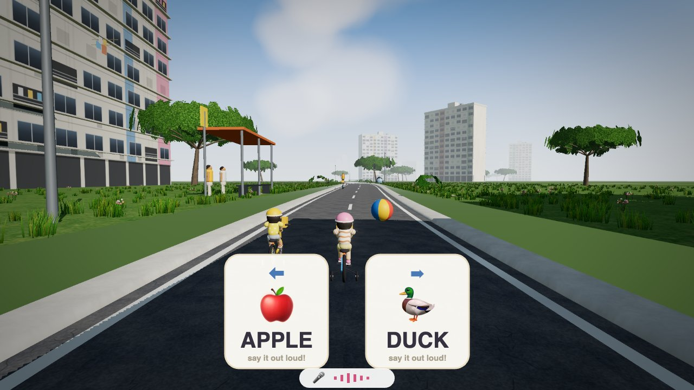
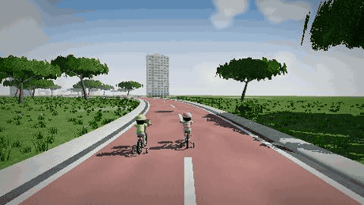
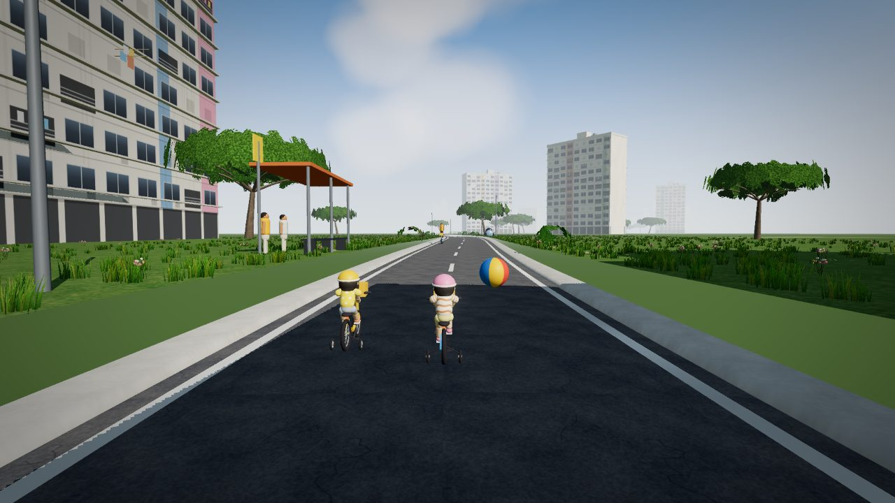
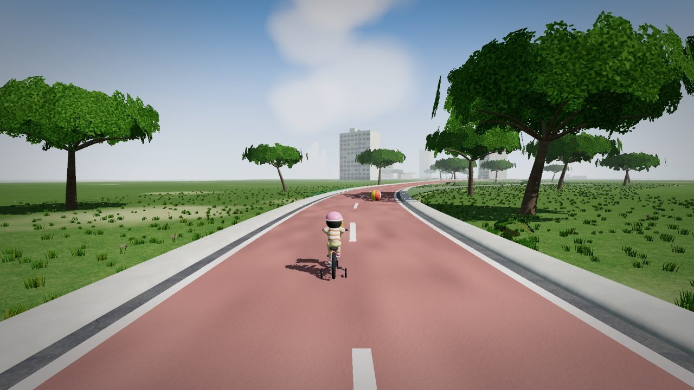
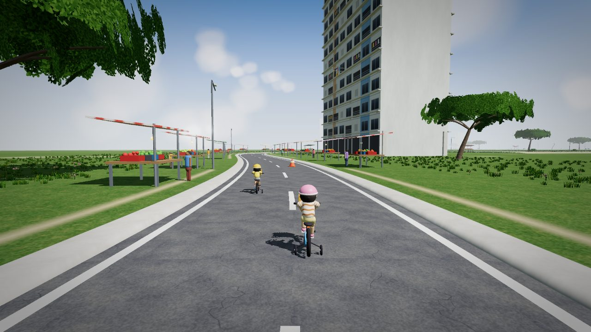
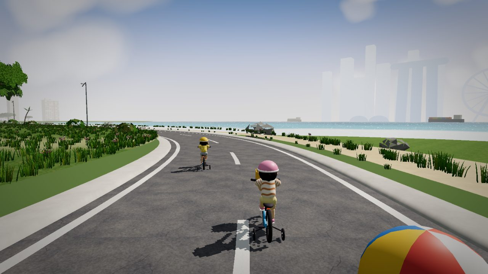
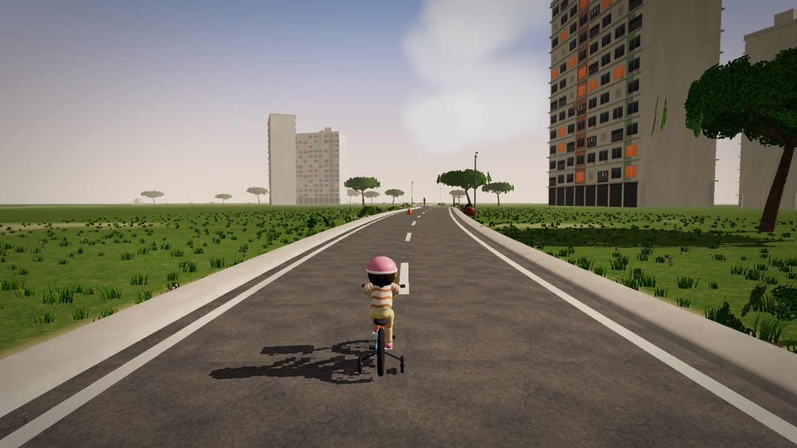
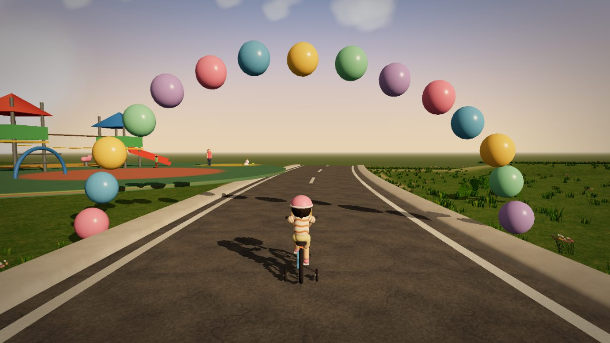

<div align="center">

# 🚲 Rae's Big Ride

### A voice-controlled 3D adventure that teaches little ones to *look, name, and speak* — by riding through Singapore.

**No buttons. No screens to poke. She talks, and the world moves.**

### ▶️ **[Play it here → raes-big-ride.vercel.app](https://raes-big-ride.vercel.app/)**
*(best in Google Chrome, with the microphone allowed)*



</div>

---

## 🎙️ The idea: her voice is the controller

Most toddler "games" are a finger mashing a tablet. This one is the opposite. A child rides a bicycle or scooter down a gentle, endless road, and to steer, avoid a sleeping cat, stop at a red light, or pick which way to go — **she reads the word on screen out loud.**

> She sees a card that says **`CAT`** with a picture of a cat. She says *"cat!"* — and her little rider swerves around it. That's the whole game. Say the word, the world responds.

It listens through the microphone (Chrome's Singapore-English speech engine), and it is **relentlessly gentle**: if she stays quiet, the bike just slows and waits, a friendly voice offers the word, and after a few tries it says it *for* her and rolls on. **There is no way to fail, and it never gets stuck.**

<div align="center">



*Real-time, rendered in the browser — no video, no pre-baked cutscene.*

</div>

---

## 🧠 Why it's genuinely good for a child

This isn't screen-time to keep a child quiet — it's **spoken-language practice disguised as a bike ride.** Every interaction is a tiny, low-pressure invitation to *notice something and say its name* — which is exactly how early vocabulary and confident speech are built.

| What she practises | How the game does it |
| --- | --- |
| 🗣️ **Talking out loud & articulation** | The entire game is powered by her voice. Shy kids warm up because there's no audience — just a bike that likes when she speaks. |
| 👀 **Recognising the world** | Cards are everyday things a 3–4-year-old knows: animals, fruit, vegetables, shapes, numbers, letters — each paired with a clear picture. |
| 🔤 **Early phonics & letters** | `B` shows a 🦋 and asks for *"butterfly"* — linking letter, sound, and object. |
| 🔢 **Counting & numbers** | *"three shells"* 🐚🐚🐚 — numbers taught as real quantities, not abstract digits. |
| 🚦 **Road sense & safety** | She learns to **stop at red, go on green**, and wait for cars to pass — rehearsing real kerbside habits. |
| 🤝 **Turn-taking & togetherness** | She can ride with her cousin **Zoe** alongside — sharing the adventure, not competing. |
| 💪 **Confidence & agency** | Her words visibly change the world. Cause and effect, spoken by her, every few seconds. |

Vocabulary is dealt from a **shuffled 80-word deck that never repeats a word until the deck runs dry**, and reshuffles every ride — so it stays fresh instead of drilling the same handful of words.

---

## 🇸🇬 A journey through six recognisable places

One continuous ~5–7 minute ride from her neighbourhood to the playground, with the light warming from morning to golden afternoon as she arrives.

<table>
  <tr>
    <td width="50%"><br><b>🏠 HDB heartland</b><br>Pastel blocks, void decks, a mama shop, laundry poles — home.</td>
    <td width="50%"><br><b>🌳 Park connector</b><br>The red PCN path under rain trees, with cyclists and butterflies.</td>
  </tr>
  <tr>
    <td><br><b>🍎 Wet market & hawker centre</b><br>Striped awnings, heaped produce, crowds — where fruit &amp; veg words live.</td>
    <td><br><b>🌊 East Coast</b><br>The sea, palms and sand, ships on the horizon, an otter family crossing.</td>
  </tr>
  <tr>
    <td><br><b>🏙️ City peek</b><br>The skyline in haze, an overhead bridge, traffic lights and crossing cars.</td>
    <td><br><b>🛝 Playground finale</b><br>A balloon arch, slides, and her plushies waiting to cheer her in.</td>
  </tr>
</table>

Every tree, building, character, texture, note of music, and sound effect is **generated in code** — there are no downloaded 3D models or images anywhere in this project.

---

## ▶️ How to play

1. Open **[raes-big-ride.vercel.app](https://raes-big-ride.vercel.app/)** in **Google Chrome** (voice needs Chrome; keep internet on).
2. **Allow the microphone** when asked.
3. Tap **Let's play** → pick a ride 🚲/🛴, a colour, a pace 🐢/🐇/🚀, and whether cousin **Zoe** comes along.
4. A quick coached **how-to-play** shows first-timers the ropes, then — off she goes!

She can say these **any time**, even mid-ride: **`left`** · **`right`** · **`faster`** · **`slower`** · **`ring ring`** (the bell). Clue cards add their own words on top.

**Grown-up helpers** (in the ⏸ / `Esc` menu, or keys): `←` `→` steer · `Enter` answers a card · music, mic sensitivity, and helper-voice toggle · restart · replay the walkthrough. On a phone or tablet, **tap the left or right side of the screen to steer.**

---

## 🛠️ Built with

- **[three.js](https://threejs.org/)** — WebGL2, custom sky & water shaders, soft shadows, a bloom + colour-grade post pipeline
- **Web Speech API** (`en-SG`) for recognition, **Web Speech Synthesis** for the friendly narrator
- **Web Audio** — the soothing piano/pad score and every sound effect are synthesised live, and the music auto-ducks whenever the game is listening
- **Vite** + vanilla ES modules · everything procedural · runs entirely in the browser (only single spoken words ever leave the device, to Chrome's speech service)

```bash
npm install
npm run dev     # then open http://localhost:5178 in Chrome
```

---

## 📓 Things we learned building it

- **Voice is a wonderful controller for a pre-reader — if it's forgiving.** The magic only works because the game never punishes silence or a mumble: fuzzy word-matching, generous aliases, gentle slow-downs, and a "we'll say it together" fallback. A single frustrating dead-end would end the whole thing for a 4-year-old.
- **Chase the flicker to its real cause, don't paper over it.** A stubborn screen-flicker survived three "fixes" aimed at the wrong thing. The culprit was finally measured, not guessed: the animated sea was a raw shader that rendered **black through the HDR post-processing pipeline**, intermittently, worsening over a session. Rebuilding it on the engine's standard material path — the same one the roads and trees use — ended it. *Measure per-frame, isolate the layer, then fix.*
- **Keep debug switches out of players' hands.** An early "smooth vs. broken" mystery turned out to be a QA URL flag (`?sim=`, `?interval=`) that had leaked into the link being played. Test flags now can't affect a real session.
- **Design for the actual player.** Reshuffled vocab (no drilling), one decision on screen at a time, picture-and-word always paired, a sibling to ride with, and touch fallbacks so it works on the family iPad — small choices that decide whether a small child stays delighted.

---

<div align="center">

Made with love for **Rae** (and her cousin **Zoe**) 💗💛

</div>
