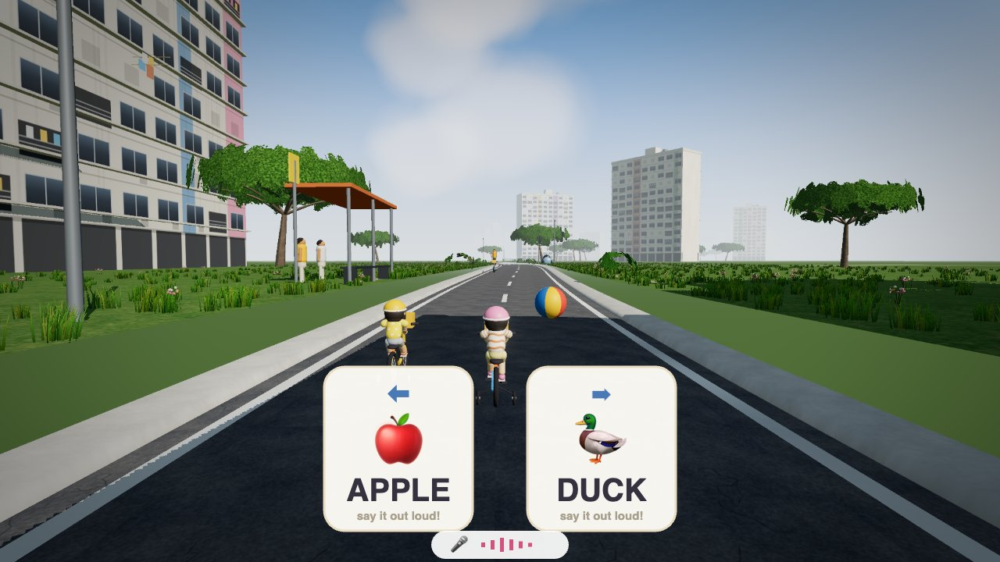
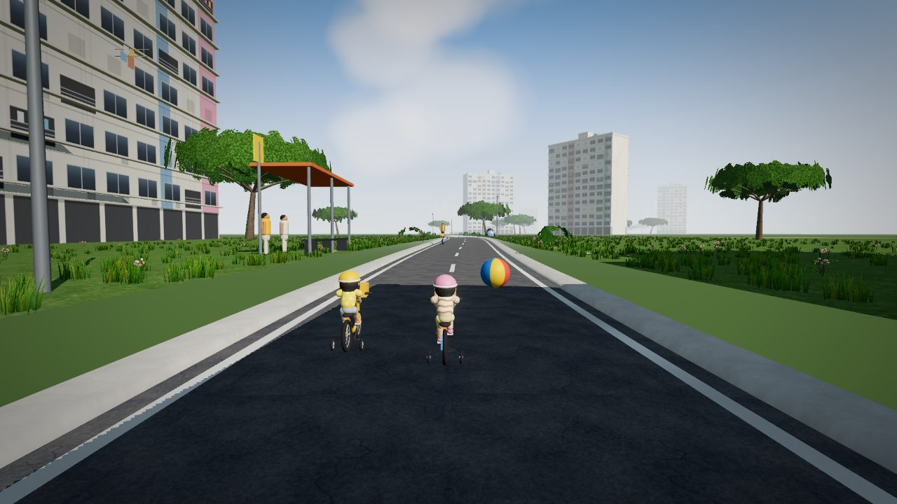
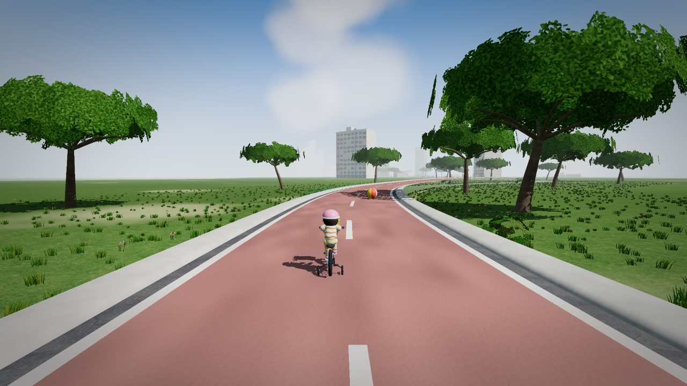
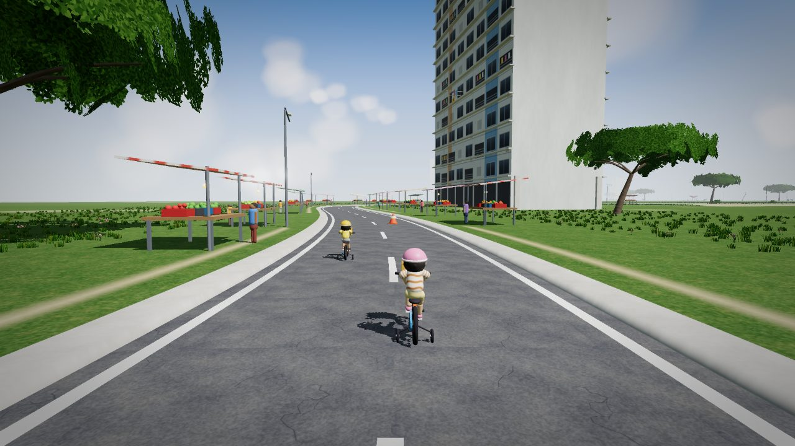
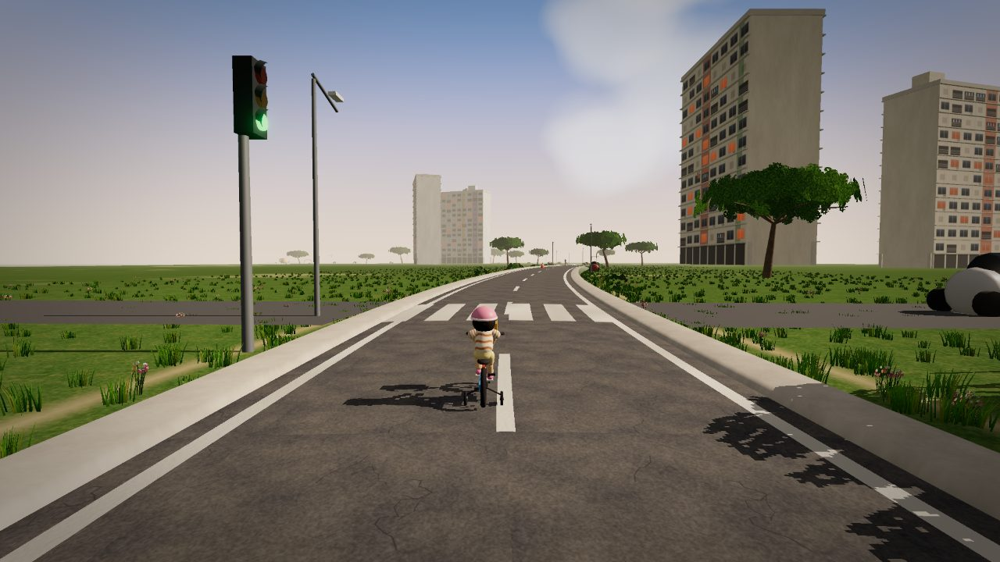
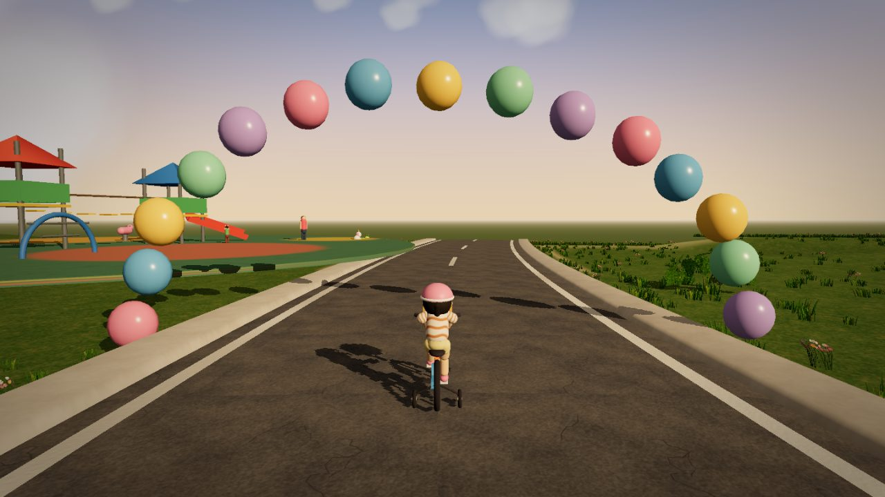

<div align="center">

# Building an open-source AI educational tool ecosystem for early childhood education!

### Rae's Big Ride: voice-guided 3D ride through six Singapore-inspired scenes

[](https://github.com/limchinhan123/raes-big-ride/actions/workflows/ci.yml)

**[Play the live demo](https://raes-big-ride.vercel.app/) · [Report an issue](https://github.com/limchinhan123/raes-big-ride/issues) · [Read the release notes](docs/releases/v1.0.0.md)**



</div>

Rae's Big Ride is a browser-based 3D adventure for young children. A player can
ride through a neighborhood, park connector, market, coast, city, and
playground while naming the word shown on the current card. Voice is the
primary interaction where browser speech recognition is available, with
touch, keyboard, and grown-up-assist fallbacks when it is not.

> **Experimental, sole-maintainer project.** This is a personal open-source
> project maintained by Brandon Lim, without a support SLA or compatibility
> guarantee. It is a playful experience, not speech therapy, a learning
> assessment, or road-safety instruction.


*The GIF is captured gameplay. The ride is rendered in real time in the
browser; it is not a pre-baked cutscene.*

## How the ride works

1. Choose a bicycle or scooter, colour, pace, and whether Zoe rides along.
2. Complete the microphone check if voice is available, then start the ride.
3. When a word card appears, say its displayed target to affect the current
   choice or event.
4. Reach the playground, explore the final playtime interaction, and collect
   the ride's stickers.

The prompt pool has **83 distinct IDs** across animals, food, shapes, numbers,
letters, everyday objects, and nature. The active deck is intentionally
weighted to **149 entries**: 66 simpler prompts appear twice, and 17 harder
prompts appear once. Repetition can therefore occur within a deck; this is not
a fixed curriculum or a promise of educational outcomes.

## Controls and fallbacks

Browser speech support and microphone permission vary by device and provider.
The game uses the Web Speech API with Singapore English (`en-SG`) when it is
available.

| Situation | Available controls |
| --- | --- |
| Voice available — desktop | Say the active card's target. `left`, `right`, `faster`, and `slower` are desktop-only voice commands. Say `ring ring` for the bell. |
| Voice available — mobile | Say the active card's target; `ring ring` remains available. Mobile deliberately does **not** enable voice steering or speed commands. |
| Touch | Tap the left or right third of the ride screen to steer. |
| Keyboard/pause | `←` / `→` steer; `Enter` runs the grown-up current-card action; `Space`, `P`, `Esc`, or the pause button opens the pause controls. |
| Voice unavailable | The game shows a grown-up action for the current card; it resolves that card's first configured target. Touch and keyboard controls remain available. |

The pause menu also offers music volume, microphone sensitivity, helper-voice,
restart, and walkthrough controls. Voice recognition is not guaranteed to work
on every browser, operating system, network, microphone, or acoustic setting.

## Early external feedback and reuse interest

### Downstream adaptation

- 🇨🇳 **Mandarin / Simplified Chinese:** [Qtheagent/raes-big-ride](https://github.com/Qtheagent/raes-big-ride) is an independent downstream adaptation for `zh-CN`, with a 31-card Mandarin vocabulary pack, localized child-facing UI, and CJK-aware speech matching.

- [public LinkedIn discussion](https://www.linkedin.com/feed/update/urn:li:activity:7487335593715359744/) has also produced positive and independent feedback:

- **Samantha Goh** highlighted the voice-only controller and the project's
  Singapore-English speech-recognition direction.
- **Tuan-Vu Trinh** asked about customizing or forking the code for integration
  into a teacher-game app. This is downstream reuse interest, not a confirmed
  integration.
- **Sam Yap** reported trying the app and said he planned to show it to his
  child; **Oliver Trabhardt** reported that it worked very well on a phone.

Separate feedback from a Singapore Codex/WhatsApp community has included
parents planning to show the project to their children. That verbatim is "I've let my son play it, and he loved it. As a parent, thank you!"

The project has also accepted a focused [external maintenance contribution
(#25)](https://github.com/limchinhan123/raes-big-ride/pull/25), reviewed and
merged through its public contribution workflow. Together, these are early
signals of parent and educator relevance, mobile use, and reuse interest—not
evidence of educational outcomes or widespread use.

## Engineering focus

The repository keeps the experimental product small while exposing a few
deliberate seams for maintenance and future reuse:

- [`src/speech/matchingEngine.js`](src/speech/matchingEngine.js) is a
  vocabulary-neutral, configurable matcher with exact, containment, prefix,
  edit-distance, and phonetic tiers. Rae-specific recognition alternatives
  stay in [`src/speech/raeLexicon.js`](src/speech/raeLexicon.js).
- [`src/speech/recognizer.js`](src/speech/recognizer.js) owns the browser speech
  lifecycle: continuous desktop listening, renewed mobile sessions, bounded
  recovery, visibility changes, and terminal fallback states.
- [`src/speech/simInput.js`](src/speech/simInput.js) and the colocated Vitest
  suites provide deterministic test seams without claiming to reproduce a
  physical microphone or speech provider.
- Three.js, Web Audio, Vite, and vanilla ES modules power a procedural runtime
  without a downloaded 3D-model, image, or audio asset pipeline.

## Six places on the ride

<table>
  <tr>
    <td width="50%"><br><b>🏠 Heartland</b><br>HDB blocks, void decks, a mama shop, and laundry poles.</td>
    <td width="50%"><br><b>🌳 Park connector</b><br>A path under rain trees, with cyclists and butterflies.</td>
  </tr>
  <tr>
    <td><br><b>🍎 Market</b><br>Stalls, produce, and a hawker-centre setting.</td>
    <td><br><b>🌊 Coast</b><br>Sea, palms, sand, ships, and otters.</td>
  </tr>
  <tr>
    <td><br><b>🏙️ City</b><br>Skyline views, an overhead bridge, traffic lights, and crossings.</td>
    <td><br><b>🛝 Playground</b><br>A balloon arch, slides, and a playtime finale.</td>
  </tr>
</table>

## Quick start

Requires Node.js `^20.19.0 || >=22.12.0`.

```bash
npm ci
npm test
npm run build
npm run dev
```

Open the local Vite URL in a browser. The current suite has **42 unit tests**;
the [CI workflow](.github/workflows/ci.yml) runs `npm ci`, `npm test`, and
`npm run build` on pull requests and pushes to `main`. It does not substitute
for real-device checks of WebGL, browser speech, microphone permissions, touch,
or accessibility behavior.

## Runtime, privacy, and media boundaries

- **Procedural runtime:** the game constructs its runtime world, textures,
  music, and sound effects in code. It does not load third-party 3D model,
  image, or audio files.
- **Committed documentation media:** the README and social preview use
  screenshots and a gameplay GIF stored in `docs/img/`. Their capture basis and
  rights status are documented in [ASSET_PROVENANCE.md](ASSET_PROVENANCE.md).
- **Browser/provider boundary:** application code does not send voice audio or
  transcripts to a Rae's Big Ride backend or analytics service. Browser speech
  recognition, its provider, ordinary hosting logs, and device permissions are
  outside this project's control. Read [PRIVACY.md](PRIVACY.md) before enabling
  the microphone, especially when setting up the game for a child.

## Project status and roadmap

The repository is open source, but it is still an experimental personal
project. Contributions are welcome when they are focused and privacy-aware;
see [CONTRIBUTING.md](CONTRIBUTING.md). The currently open roadmap work is:

- [#14 — configurable language and vocabulary packs](https://github.com/limchinhan123/raes-big-ride/issues/14)
- [#15 — extract the child-friendly speech matcher only after real reuse](https://github.com/limchinhan123/raes-big-ride/issues/15)

Neither item is a promise, and no npm package is published from this repository.

## Open-source documentation

- [Architecture overview](docs/ARCHITECTURE.md)
- [Contributing guide](CONTRIBUTING.md)
- [Changelog](CHANGELOG.md)
- [Release process](docs/RELEASING.md)
- [Privacy policy](PRIVACY.md)
- [Security policy](SECURITY.md)
- [Third-party notices](THIRD_PARTY_NOTICES.md)
- [Asset provenance](ASSET_PROVENANCE.md)
- [MIT License](LICENSE)

## License

Rae's Big Ride is available under the [MIT License](LICENSE). Third-party
software and font obligations are listed in [THIRD_PARTY_NOTICES.md](THIRD_PARTY_NOTICES.md).
